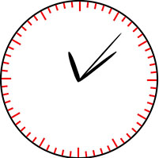

# some-lite
一些小实现
### 1 用CSS动画实现的一个 行走的钟表
* 主要技术： CSS animation
* 代码在 [jsbin 链接](http://jsbin.com/sujocexuyi/edit?html,css,js,output)
* 效果图 

### 2 用js完成一个 四人赛制比赛的人员速配的实现方案，适用于各类球类比赛 四人双打的比赛规制，例如在羽毛球比赛中，根据报名人数，自动完成人员配对
* 代码在 [jsbin 链接](http://jsbin.com/casedajove/edit?html,console,output)
### 3 图片懒加载
* 主要技术： 节流、懒加载、获得元素边界距离文档的距离
### 4 js实现轮播
* 主要技术：dom操作，css过度